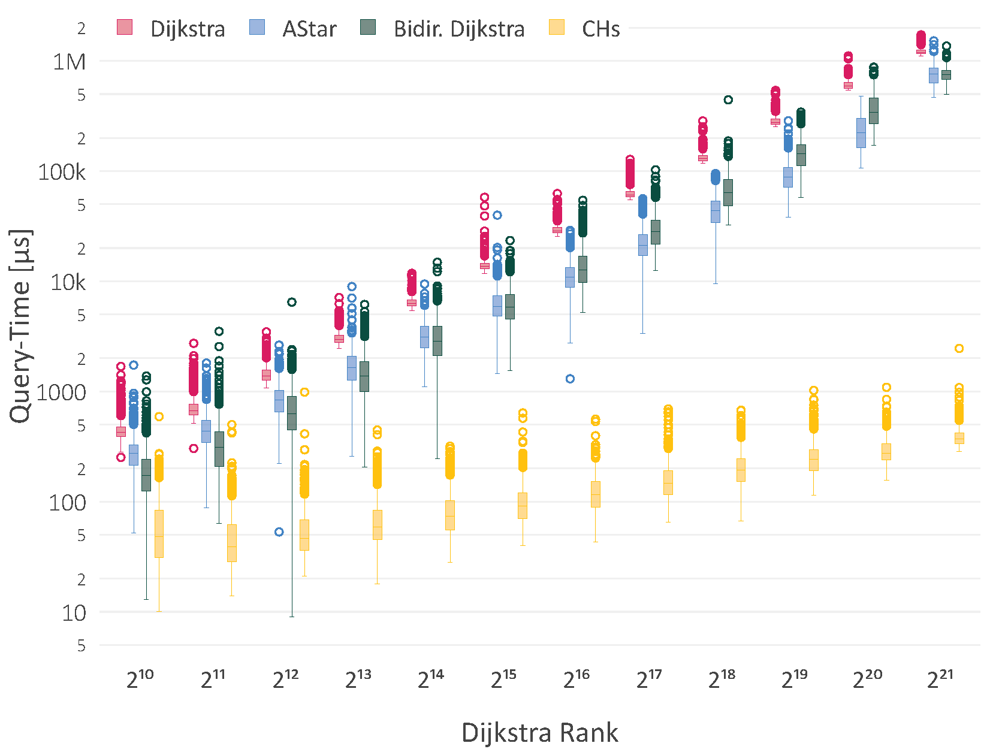
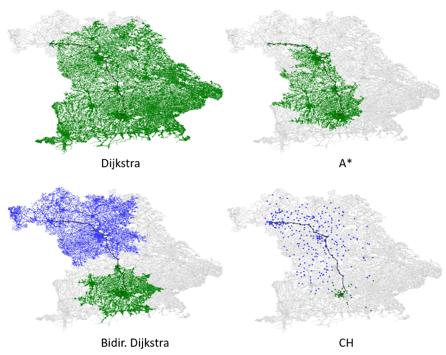

<h2 align="center">Bachelorthesis:</h2>
<h1 align="center">Efficient routeplanning in road networks with Contraction Hierachies</h1>

<b>Daniel Holzner</b>

<b>17.09.2023</b>

---

### Summary
This thesis addresses a fundamental problem in graph theory: the computation of shortest
paths between two nodes in a graph. A practical area of application for this problem is route
planning in road networks, where the goal is to determine the quickest route between two
locations. While conventional algorithms such as Dijkstra or A⋆ are capable of handling this
task, they reach their limits when dealing with large graphs with millions of nodes and edges.
This limits their applicability, for example, in real-time navigation and
location-based services.

The Contraction Hierarchies technique, initially introduced by Geisberger et al., can overcome
these limitations. In this method, additional information is added to the graph during a
precomputation phase by adding shortcut edges. These shortcut edges are then used in the
search phase to speed up the search process. The goal of this thesis is to show, by implementing
this technique, how the computation of shortest paths in road networks can be accelerated. A
comparison of the results of this technique with traditional methods such as Dijkstra or A⋆ will
also be part of the research.

The implementation was realised in the Rust programming language and is available as a Rust
library. The runtime analysis shows a significant improvement in execution speed compared
to Dijkstra and A⋆. All measurements were performed on real road data from the OpenData
project OpenStreetMap. In large road networks, comparable to the size of Germany (10 million
nodes and 22 million edges), path calculations over long distances can be performed in less
than one millisecond by using Contraction Hierarchies, which results in an improvement factor
of more than 1000 compared to the standard methods.

---
### Performance

--- 
### Search space

  

---
### Visualization

